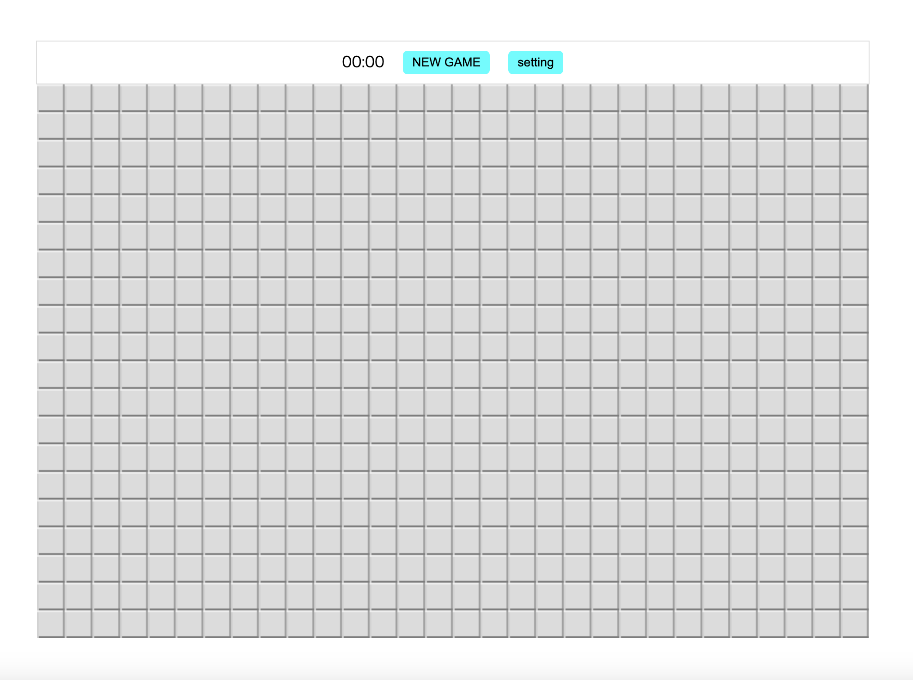

# 概要

* 昔懐かしいマインスイーパです。
* ランキング機能はありますが、セッションやlocalStorageすら使っておらず、リロードしたら消えます。

# ビルドと実行

## 開発

* nodeJSがインストール済みである前提です。開発は `v16.13.2` で行っていますが、他のバージョンでも動作するかもしれません。
* `src` ディレクトリで `npm run dev` すると、tsファイルの変更が自動で反映されるようになります。
  * 実行後に表示される通り、 `localhost:9000` で動作確認できます。ポート番号は `webpack.config.js` から変更できます。

## 本番

* `src` ディレクトリで `npm run build` で、distディレクトリにjsがビルドされます。
* index.html、main.css、distディレクトリをサーバにホスティングすれば動作する、はずです。

